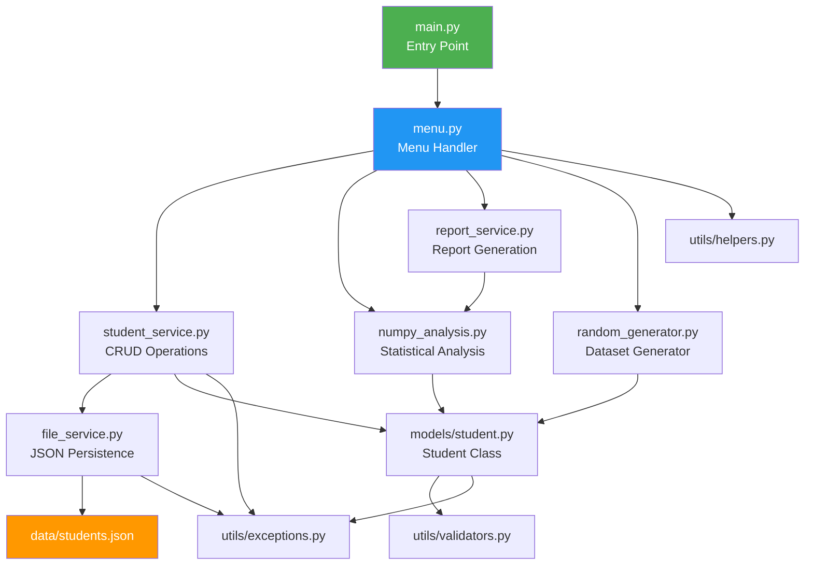

# Student Record Management & Marks Analysis System

Build a fully menu-driven, modular Python application for managing student records and performing marks analysis using NumPy. The system follows OOP, file handling, exception handling, and clean code principles.

## Proposed Changes

### 1. Configuration & Utilities (Foundation Layer)

These modules have zero dependencies and are built first.

#### [NEW] [config.py](file:///home/smilo/Desktop/Basic_Student_Perfomance_Analytics_System/student_record_system/config.py)
- Application-wide constants: `DATA_DIR`, `DATA_FILE`, `SUBJECTS` list, `PASS_MARK`, `MAX_MARKS`, `MIN_MARKS`
- Default subjects: `["Math", "Physics", "Chemistry", "English", "Computer Science"]`
- Pass threshold: 35 per subject, overall pass: all subjects ≥ 35

#### [NEW] [exceptions.py](file:///home/smilo/Desktop/Basic_Student_Perfomance_Analytics_System/student_record_system/utils/exceptions.py)
- Custom exceptions: `StudentNotFoundError`, `DuplicateStudentError`, `InvalidMarksError`, `InvalidInputError`, `FileCorruptedError`
- All inherit from a base `StudentSystemError`

#### [NEW] [validators.py](file:///home/smilo/Desktop/Basic_Student_Perfomance_Analytics_System/student_record_system/utils/validators.py)
- `validate_student_id(sid)` — must be positive integer
- `validate_name(name)` — non-empty, alphabetic
- `validate_marks(marks)` — each mark 0–100, must match subject count
- `validate_menu_choice(choice, valid_range)` — integer within range

#### [NEW] [helpers.py](file:///home/smilo/Desktop/Basic_Student_Perfomance_Analytics_System/student_record_system/utils/helpers.py)
- `clear_screen()`, `pause()`, `print_header()`, `print_separator()`
- Table formatting utilities for aligned console output

---

### 2. Student Model (OOP Layer)

#### [NEW] [student.py](file:///home/smilo/Desktop/Basic_Student_Perfomance_Analytics_System/student_record_system/models/student.py)
- `Student` class with:
  - **Constructor**: `__init__(self, student_id, name, marks)` with validation
  - **Properties** (encapsulation): `student_id`, `name`, `marks` with getters/setters
  - **Methods**: `to_dict()`, `from_dict(data)` (class method), `get_total()`, `get_average()`, `is_passed()`, `get_grade()`
  - **Dunder methods**: `__str__`, `__repr__`, `__eq__`
- Grade scale: A+ (≥90), A (≥80), B+ (≥70), B (≥60), C (≥50), D (≥35), F (<35)

---

### 3. Service Layer (Business Logic)

#### [NEW] [file_service.py](file:///home/smilo/Desktop/Basic_Student_Perfomance_Analytics_System/student_record_system/services/file_service.py)
- `FileService` class:
  - `save_students(students)` — serialize to JSON, write to `data/students.json`
  - `load_students()` — read JSON, deserialize to `Student` objects
  - Handles: `FileNotFoundError`, `json.JSONDecodeError`, `PermissionError`
  - Creates `data/` directory if missing; creates backup before overwrite

#### [NEW] [student_service.py](file:///home/smilo/Desktop/Basic_Student_Perfomance_Analytics_System/student_record_system/services/student_service.py)
- `StudentService` class:
  - Maintains in-memory list of `Student` objects
  - `add_student(student)` — checks for duplicate ID before adding
  - `view_all_students()` — returns list of all students
  - `search_student(keyword)` — search by ID or partial name match
  - `update_student(student_id, **kwargs)` — update name or marks
  - `delete_student(student_id)` — remove by ID
  - Auto-saves after every mutation via `FileService`

#### [NEW] [numpy_analysis.py](file:///home/smilo/Desktop/Basic_Student_Perfomance_Analytics_System/student_record_system/services/numpy_analysis.py)
- `NumpyAnalysis` class:
  - **Marks Matrix**: Build 2D NumPy array from all students (rows=students, cols=subjects)
  - **Statistics**: `total_marks()`, `mean_marks()`, `median_marks()`, `std_marks()`, `min_marks()`, `max_marks()` — all using NumPy, with axis control (per-student, per-subject, overall)
  - **Broadcasting**: `apply_grace_marks(uniform_grace)`, `apply_subject_grace(grace_array)` — add scalar or per-subject array to all rows
  - **Matrix Operations**: `transpose()`, `row_sum()`, `col_sum()`, `row_mean()`, `col_mean()`
  - **Boolean Indexing**: `get_passed_students()`, `get_failed_students()`, `get_toppers(n)`, `get_above_threshold(threshold)`

#### [NEW] [random_generator.py](file:///home/smilo/Desktop/Basic_Student_Perfomance_Analytics_System/student_record_system/services/random_generator.py)
- `RandomGenerator` class:
  - `generate_students(count)` — create `count` random students with random names and marks
  - Uses `numpy.random` for marks generation (0–100 integers)
  - Random names from a predefined list of first/last names
  - Returns list of `Student` objects

#### [NEW] [report_service.py](file:///home/smilo/Desktop/Basic_Student_Perfomance_Analytics_System/student_record_system/services/report_service.py)
- `ReportService` class:
  - `student_report(student)` — detailed single-student report
  - `class_summary(students)` — tabular overview of all students
  - `statistics_report(students)` — statistical summary using NumPy

---

### 4. Menu & Main Entry Point (Presentation Layer)

#### [NEW] [menu.py](file:///home/smilo/Desktop/Basic_Student_Perfomance_Analytics_System/student_record_system/menu.py)
- `MenuHandler` class managing all menu navigation:
  - **Main Menu**: Student Management | NumPy Analysis | Reports | Random Generator | Exit
  - **Student Management Sub-menu**: Add | View All | Search | Update | Delete | Back
  - **NumPy Analysis Sub-menu**: Statistics | Broadcasting | Matrix Operations | Boolean Indexing | Back
  - **Reports Sub-menu**: Student Report | Class Summary | Statistics Report | Back
- Each menu option dispatches to the appropriate service method
- All inputs wrapped in try/except with validation

#### [NEW] [main.py](file:///home/smilo/Desktop/Basic_Student_Perfomance_Analytics_System/student_record_system/main.py)
- Entry point: instantiates services, loads data, launches menu loop
- `if __name__ == "__main__":` guard
- Graceful shutdown with save-on-exit

---

### 5. Data & Dependencies

#### [NEW] [students.json](file:///home/smilo/Desktop/Basic_Student_Perfomance_Analytics_System/student_record_system/data/students.json)
- Empty JSON array `[]` as initial data file

#### [NEW] [requirements.txt](file:///home/smilo/Desktop/Basic_Student_Perfomance_Analytics_System/student_record_system/requirements.txt)
- `numpy>=1.21.0`

#### [NEW] `__init__.py` files
- Empty `__init__.py` in `models/`, `services/`, `utils/` for package imports

---

### 6. Documentation

#### [NEW] [README.md](file:///home/smilo/Desktop/Basic_Student_Perfomance_Analytics_System/student_record_system/docs/README.md)
- Project overview, features list, installation, usage guide, screenshots of menu

#### [NEW] [Architecture.md](file:///home/smilo/Desktop/Basic_Student_Perfomance_Analytics_System/student_record_system/docs/Architecture.md)
- Layered architecture diagram (Presentation → Service → Model → Data)
- Module dependency graph

#### [NEW] [Workflow.md](file:///home/smilo/Desktop/Basic_Student_Perfomance_Analytics_System/student_record_system/docs/Workflow.md)
- User flow diagrams for each major feature

#### [NEW] [Database.md](file:///home/smilo/Desktop/Basic_Student_Perfomance_Analytics_System/student_record_system/docs/Database.md)
- JSON schema documentation, data format explanation

#### [NEW] [Testing.md](file:///home/smilo/Desktop/Basic_Student_Perfomance_Analytics_System/student_record_system/docs/Testing.md)
- Test cases for each module, manual testing checklist

#### [NEW] [Security.md](file:///home/smilo/Desktop/Basic_Student_Perfomance_Analytics_System/student_record_system/docs/Security.md)
- Input validation strategy, file handling safety

#### [NEW] [Installation.md](file:///home/smilo/Desktop/Basic_Student_Perfomance_Analytics_System/student_record_system/docs/Installation.md)
- Step-by-step installation and setup guide

#### [NEW] [Troubleshooting.md](file:///home/smilo/Desktop/Basic_Student_Perfomance_Analytics_System/student_record_system/docs/Troubleshooting.md)
- Common errors and fixes

#### [NEW] [Project_Deep_Explanation.md](file:///home/smilo/Desktop/Basic_Student_Perfomance_Analytics_System/student_record_system/docs/Project_Deep_Explanation.md)
- In-depth explanation of every module, design decisions, learning outcomes mapped to code

---

## Architecture Overview



## Key Design Decisions

| Decision | Rationale |
|---|---|
| JSON for storage | Human-readable, no external DB dependency, easy to debug |
| Service layer pattern | Separates business logic from presentation and data |
| NumPy for all analysis | Demonstrates broadcasting, indexing, matrix ops as required |
| Auto-save on mutation | Prevents data loss, simulates real-world persistence |
| Custom exceptions | Clean error handling, specific error messages |
| Encapsulation via properties | Demonstrates OOP with validation in setters |

## Verification Plan

### Automated Tests
```bash
cd /home/smilo/Desktop/Basic_Student_Perfomance_Analytics_System/student_record_system
python -c "from models.student import Student; s = Student(1, 'Test', [90,80,70,60,50]); print(s); print('PASS' if s.is_passed() else 'FAIL')"
python main.py  # Interactive test of all menu options
```

### Manual Verification
- Run the application and test each menu path
- Verify JSON file persistence after add/update/delete
- Verify NumPy analysis output matches manual calculation
- Test edge cases: empty data, invalid inputs, corrupted file
